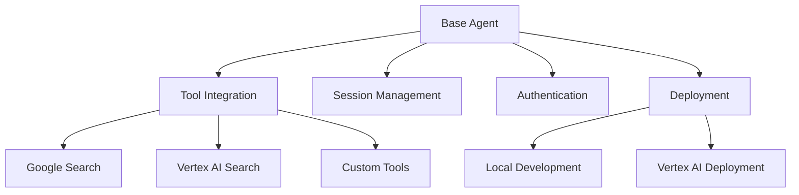

# Google ADK Agent Starter Kit - Project Planning

## 1. Project Overview

The Google ADK Agent Starter Kit provides a standardized foundation for building AI agents using Google's Agent Development Kit (ADK). This starter kit aims to simplify the development process by providing reusable components, patterns, and examples that developers can use as templates for their own agent implementations.

## 2. Goals and Objectives

- Create a minimal yet complete foundation for building Google ADK agents
- Provide clear patterns for integrating built-in tools like Google Search
- Simplify deployment to Vertex AI
- Establish consistent patterns for agent development
- Enable rapid prototyping and development of new agents

## 3. Architecture

### 3.1. Core Components



### 3.2. Project Structure

```
agent-starter-kit/
├── README.md                 # Documentation and getting started guide
├── requirements.txt          # Dependencies
├── .env.example              # Template for environment variables
├── setup.py                  # Package setup for distribution
├── src/
│   ├── __init__.py
│   ├── config.py             # Configuration settings
│   ├── agents/
│   │   ├── __init__.py
│   │   ├── base_agent.py     # Base agent template with common functionality
│   │   └── search_agent.py   # Example Google Search agent implementation
│   ├── tools/
│   │   ├── __init__.py
│   │   └── custom_tools.py   # Template for creating custom tools
│   ├── utils/
│   │   ├── __init__.py
│   │   ├── auth.py           # Authentication utilities
│   │   └── logging.py        # Logging configuration
│   └── deployment/
│       ├── __init__.py
│       └── vertex.py         # Vertex AI deployment utilities
├── examples/
│   ├── simple_search_agent.py       # Basic search agent example
│   ├── multi_tool_agent.py          # Example with multiple tools
│   └── streaming_agent.py           # Example with streaming capabilities
└── tests/
    ├── __init__.py
    ├── test_search_agent.py
    └── test_custom_tools.py
```

## 4. Design Decisions

### 4.1. Agent Design

- **Base Agent Template**: Provide a standardized base agent that handles common functionality like authentication, session management, and error handling.
- **Modular Tool Integration**: Design a clean pattern for integrating built-in and custom tools.
- **Configuration-Driven**: Use configuration files and environment variables for customization rather than code changes.

### 4.2. Tool Integration

- **Built-in Tools First**: Focus on seamless integration with Google's built-in tools (Google Search, Vertex AI Search).
- **Custom Tool Pattern**: Provide a clear pattern for creating custom tools that follow the same interface as built-in tools.
- **Tool Registry**: Implement a registry pattern for tools to make them discoverable and manageable.

### 4.3. Deployment Strategy

- **Local Development**: Support local development and testing with minimal setup.
- **Vertex AI Deployment**: Provide utilities and documentation for deploying to Vertex AI.
- **Environment Parity**: Ensure consistency between local development and cloud deployment.

## 5. Implementation Approach

### 5.1. Minimalist Core

The starter kit will follow a minimalist approach, providing only the essential components needed for a functional agent. This ensures:

- Lower learning curve for new developers
- Easier maintenance
- Flexibility for different use cases

### 5.2. Extensibility

While minimalist, the core will be designed for extensibility:

- Clear extension points for adding new functionality
- Hooks for custom pre/post processing
- Plugin architecture for tools

### 5.3. Documentation-First

The starter kit will prioritize documentation:

- Comprehensive README with getting started guide
- Inline code documentation
- Example implementations for common use cases
- Best practices and patterns

## 6. Development Standards

### 6.1. Code Quality

- Follow PEP 8 style guide
- Use type hints
- Implement comprehensive error handling
- Write unit tests for all components

### 6.2. Documentation

- Document all public APIs
- Provide usage examples
- Include deployment instructions
- Document configuration options

### 6.3. Testing

- Unit tests for all components
- Integration tests for end-to-end functionality
- Example-based tests for documentation

## 7. Future Expansion

While the initial version will focus on text-based agents with Google Search capabilities, the architecture will support future expansion to:

- Voice and video capabilities
- Multi-agent systems
- Custom workflow agents
- Additional built-in tools

## 8. Success Criteria

The starter kit will be considered successful if:

- Developers can create a new agent with minimal boilerplate
- Agents can be deployed to Vertex AI with minimal configuration
- The pattern is extensible for different use cases
- Documentation is comprehensive and clear
