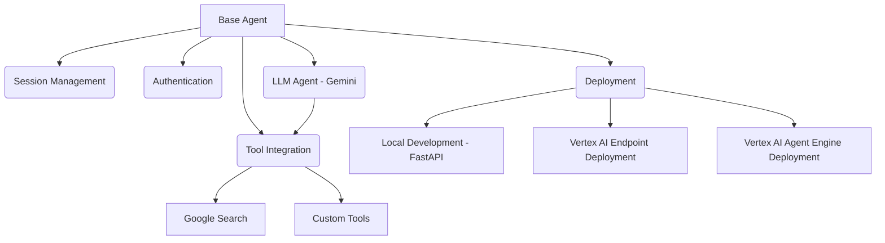
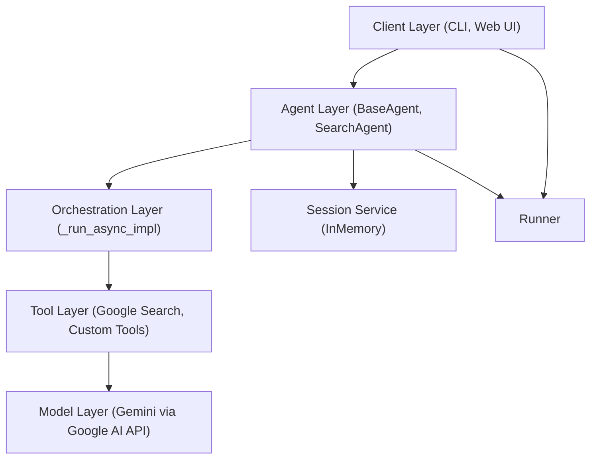
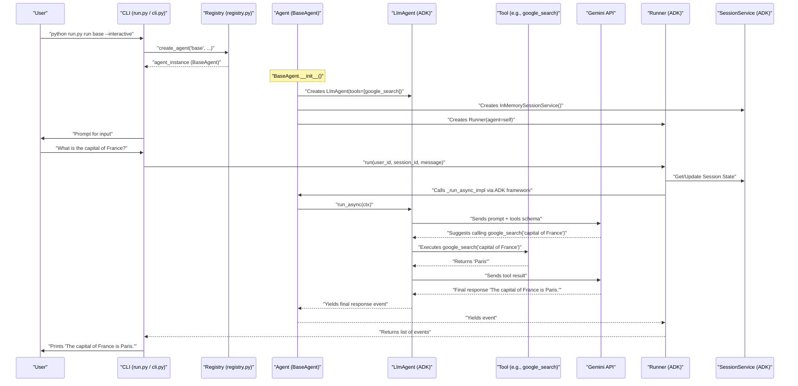

# Google ADK Agent Starter Kit - Project Visualization

## 1. Project Overview

The Google ADK Agent Starter Kit provides a standardized foundation for building AI agents using Google's Agent Development Kit (ADK). It implements a true custom agent architecture that inherits directly from Google's `BaseAgent` class and follows the recommended patterns for custom agent development. The kit includes reusable components, patterns, and examples that developers can use as templates for their own agent implementations.

### 1.1. Goals and Objectives

*   Create a minimal yet complete foundation for building Google ADK agents.
*   Provide clear patterns for integrating built-in tools like Google Search.
*   Simplify deployment to Vertex AI and local development.
*   Establish consistent patterns for agent development.
*   Enable rapid prototyping and development of new agents.

### 1.2. Key Features

*   **True Custom Agent Architecture**: Inherits directly from Google's `BaseAgent` class.
*   **LLM Integration**: Uses Google's Gemini models.
*   **Tool Integration**: Seamless integration with Google Search and custom tools.
*   **Flexible Orchestration**: Supports complex orchestration patterns.
*   **Comprehensive Testing**: Includes unit tests (Pytest).
*   **Interactive Mode**: Supports interactive conversations via CLI.
*   **Deployment Options**: Local (FastAPI), Vertex AI Endpoint, and Vertex AI Agent Engine.
*   **Configuration Driven**: Uses `.env` files for configuration.
*   **Extensibility**: Agent registry pattern for easy addition of new agent types.

---

## 2. Architecture

### 2.1. Core Components Diagram

This diagram shows the main functional components and their relationships as defined in `docs/PLANNING_1.md`.



### 2.2. Layered Architecture

The starter kit follows a layered architecture promoting modularity and separation of concerns, as detailed in `docs/DOCUMENTATION_1.md`.



*   **Client Layer**: Interacts with the user (e.g., CLI, Web UI).
*   **Agent Layer**: Contains the core agent logic (`BaseAgent`, specific agents like `SearchAgent`). Manages sub-agents, sessions, and runners.
*   **Orchestration Layer**: Custom logic within the agent's `_run_async_impl` method, deciding how to use tools and models.
*   **Tool Layer**: Provides specific capabilities (e.g., web search, custom functions).
*   **Model Layer**: Interacts with the underlying Large Language Model (Gemini).
*   **Session Service**: Manages conversation state.
*   **Runner**: Handles the execution flow for a given session.

---

## 3. Project Structure

The project follows a standard Python package structure:

```
MonteCarloRisk_AI/
├── .env                  # Environment variables (local, not committed)
├── .env.example          # Example environment variables
├── .gitignore            # Git ignore rules
├── pytest.ini            # Pytest configuration
├── README.md             # Project overview and setup guide
├── requirements.txt      # Python dependencies
├── run.py                # Main CLI entry point
├── chat.py               # Script to interact with deployed agent via SDK
├── direct_deploy.py      # Streamlined script for direct deployment (recommended)
├── commands.txt          # Useful commands for reference
├── TASK.md               # Current and completed tasks
├── backup/               # Backup directory (ignored by git)
├── setup.py              # Package setup for distribution
├── docs/                 # Documentation files
│   ├── ACTION_ITEMS.md   # Action items and improvements
│   ├── DOCUMENTATION_1.md  # Detailed project documentation
│   ├── PLANNING.md         # Architecture and planning document
│   ├── PYDANTIC_USAGE.md   # Pydantic guidelines
│   ├── AGENT_ENGINE_DEPLOYMENT.md # Guide for deploying to Agent Engine
│   ├── DIRECT_DEPLOY.md    # Guide for direct deployment (recommended)
│   ├── project_visualization.html # This document in HTML format
│   ├── project_visualization.md   # This document
│   └── index.md          # Central documentation index
├── environments/         # Environment-specific configurations
│   ├── development.yaml  # Development environment configuration
│   ├── staging.yaml      # Staging environment configuration
│   └── production.yaml   # Production environment configuration
├── examples/             # Example agent usage scripts
│   ├── __init__.py
│   ├── multi_tool_agent.py
│   ├── simple_search_agent.py
│   └── streaming_agent.py
├── src/                  # Source code directory
│   ├── __init__.py
│   ├── cli.py            # Command Line Interface implementation
│   ├── config.py         # Configuration loading (from .env)
│   ├── registry.py       # Agent type registry
│   ├── agents/           # Agent implementations
│   │   ├── __init__.py
│   │   └── base_agent.py # Core base agent class (includes search capability)
│   ├── deployment/       # Deployment utilities
│   │   ├── __init__.py
│   │   ├── local.py      # Local FastAPI server deployment
│   │   ├── vertex.py     # Vertex AI deployment helpers
│   │   ├── static/       # Static files for local web UI
│   │   │   ├── css/chat.css
│   │   │   └── js/chat.js
│   │   └── templates/    # HTML templates for local web UI
│   │       └── index.html
│   ├── tools/            # Tool implementations
│   │   ├── __init__.py
│   │   └── custom_tools.py # Custom tool creation utilities & examples
│   └── utils/            # Utility modules
│       ├── __init__.py
│       ├── auth.py       # Authentication helpers
│       └── logging.py    # Logging setup
└── tests/                # Unit and integration tests (Pytest)
    ├── __init__.py
    ├── test_custom_tools.py
    └── test_registry.py
```

---

## 4. Core Components

### 4.1. BaseAgent (`src/agents/base_agent.py`)

The foundation of the agent architecture, inheriting directly from Google's `ADKBaseAgent`.

*   **Inheritance**: Extends `google.adk.agents.BaseAgent`.
*   **Initialization (`__init__`)**:
    *   Takes name, model, description, instruction, tools, etc.
    *   Performs validation using internal methods (`_validate_model`, `_validate_tools`) following the hybrid Pydantic approach.
    *   Initializes the parent `ADKBaseAgent`.
    *   Creates and manages an internal `LlmAgent` (`self._llm_agent`) for reasoning, passing it the model, instruction, and tools.
    *   Sets up session management (default: `InMemorySessionService`).
    *   Creates a `Runner` instance for execution.
*   **Orchestration (`_run_async_impl`)**:
    *   The core logic method required by `ADKBaseAgent`.
    *   Currently, it delegates execution directly to the internal `LlmAgent` (`self._llm_agent.run_async(ctx)`).
    *   This is the primary place to customize agent behavior, add conditional logic, or orchestrate multiple sub-agents or tools.
*   **Pydantic Usage**: Uses a hybrid approach. Sets `model_config = {"arbitrary_types_allowed": True}` and uses internal validation methods rather than Pydantic field definitions.
*   **Helper Methods**: Provides methods like `run`, `run_and_get_response`, `create_session`, `get_session` for easier interaction.

```python
# Simplified __init__ from src/agents/base_agent.py
class BaseAgent(ADKBaseAgent):
    model_config = {"arbitrary_types_allowed": True}

    def __init__(self, name: str, model: str = DEFAULT_MODEL, ..., tools: Optional[List[Any]] = None, **kwargs):
        # ... validation ...
        super().__init__(name=name, ...)

        self._model = validated_model
        self._instruction = instruction
        self._tools = validated_tools
        # ...

        self._llm_agent = LlmAgent(
            name=f"{name}_llm",
            model=self._model,
            instruction=instruction,
            tools=self._tools,
        )
        self.sub_agents.append(self._llm_agent)
        # ... session service, runner ...

    @override
    async def _run_async_impl(self, ctx: InvocationContext) -> AsyncGenerator[Event, None]:
        logger.info(f"[{self.name}] Running LLM agent")
        async for event in self._llm_agent.run_async(ctx):
            yield event
        logger.info(f"[{self.name}] Agent execution completed")
```

### 4.2. Registry System (`src/registry.py`)

A mechanism for registering and creating different types of agents dynamically.

*   **Purpose**: Decouples agent creation from the code that uses agents (like the CLI). Allows adding new agent types without modifying the core CLI logic.
*   **Functionality**:
    *   `register_agent_type(type_name, factory_function)`: Adds an agent type and its creation function.
    *   `get_agent_factory(type_name)`: Retrieves the factory function.
    *   `create_agent(type_name, **kwargs)`: Creates an agent instance using its factory.
    *   `list_agent_types()`: Returns available agent types.
*   **Usage**: Uses factory functions to create agents. The CLI (`src/cli.py`) uses this registry to know which agents it can run.

```python
# Simplified usage from src/registry.py
_agent_registry: Dict[str, AgentFactory] = {}

def register_agent_type(agent_type: str, factory: AgentFactory) -> None:
    _agent_registry[agent_type] = factory

def create_agent(agent_type: str, **kwargs) -> Any:
    factory = get_agent_factory(agent_type)
    return factory(**kwargs)

# Registering BaseAgent
from .agents.base_agent import BaseAgent
def _create_base_agent(**kwargs) -> BaseAgent:
    # Note: BaseAgent might require specific tools or config depending on usage
    return BaseAgent(
        name=kwargs.get('name', 'base_agent'),
        model=kwargs.get('model'),
        description=kwargs.get('description', 'A generic base agent.'),
        instruction=kwargs.get('instruction', 'I am a base agent.'),
        tools=[google_search], # Add the google_search tool
        **kwargs
    )

register_agent_type("base", _create_base_agent)
```

### 4.3. Tools (`src/tools/custom_tools.py`, `google.adk.tools`)

Functions that agents can call to perform specific actions.

*   **Built-in Tools**: The kit uses `google_search` from `google.adk.tools`.
*   **Custom Tools**:
    *   Defined as standard Python functions with type hints and docstrings.
    *   The docstring is crucial as it tells the LLM what the tool does and how to use it.
    *   `src/tools/custom_tools.py` provides helpers (`create_custom_tool`, `CustomToolBuilder`) to wrap these functions into `FunctionTool` objects compatible with the ADK.
    *   Example: `get_current_time` tool is defined and created.
*   **Integration**: Tools are passed to the `BaseAgent` (and subsequently the internal `LlmAgent`) during initialization. The `LlmAgent` decides when to call a tool based on the conversation and tool descriptions.

```python
# Example from src/tools/custom_tools.py
from google.adk.tools import FunctionTool

def get_current_time(timezone: str = "UTC") -> str:
    """
    Get the current time in a specific timezone.

    Args:
        timezone: The timezone to get the time for (default: UTC).

    Returns:
        The current time in the specified timezone.
    """
    # Placeholder implementation
    return f"The current time in {timezone} is 12:00 PM."

# Creating the tool
current_time_tool = FunctionTool(get_current_time)

# Using the helper
# current_time_tool = create_custom_tool(get_current_time)
```

### 4.4. Configuration (`src/config.py`)

Manages application settings using environment variables.

*   **Loading**: Uses `python-dotenv` to load variables from a `.env` file.
*   **Variables**: Defines constants for settings like `GOOGLE_API_KEY`, `GOOGLE_CLOUD_PROJECT`, `DEFAULT_MODEL`, `LOG_LEVEL`, `WEB_UI_PORT`, etc.
*   **Access**: Provides a `get_config()` function to retrieve settings as a dictionary.
*   **Validation**: Includes a `validate_config()` function to check for required settings based on the mode (Vertex AI vs API Key).

### 4.5. Deployment (`src/deployment/`, `direct_deploy.py`, `deploy_agent_engine.py`)

Handles running the agent locally or deploying to Vertex AI.

*   **Local (`local.py`)**:
    *   Uses FastAPI and Uvicorn to run a local web server.
    *   Provides a simple WebSocket-based chat interface (HTML/CSS/JS in `static/` and `templates/`).
    *   Handles multiple sessions.
    *   Manages port conflicts by trying subsequent ports if the default is busy.

*   **Vertex AI Endpoint (`vertex.py`)**:
    *   Contains helper functions (`prepare_deployment_package`, `deploy_to_vertex_ai`) to package the agent source code and deploy it as a Vertex AI Endpoint.
    *   Generates a `main.py` entry point for the Vertex AI container that uses the agent registry to instantiate the correct agent.

*   **Direct Deployment to Agent Engine (`direct_deploy.py`) - Recommended**:
    *   Provides a streamlined deployment process for Vertex AI Agent Engine.
    *   Reads configuration directly from environment variables (.env file).
    *   Handles the entire deployment process in a single script:
        *   Creates an agent instance with default or configured parameters
        *   Tests the agent locally before deployment
        *   Deploys to Vertex AI Agent Engine
        *   Updates chat.py with the new Agent Engine ID
        *   Creates a backup of the original chat.py file
    *   Simple to use with minimal configuration (just run `python direct_deploy.py`).

*   **Configurable Deployment to Agent Engine (`deploy_agent_engine.py`)**:
    *   Provides a more configurable deployment script for Vertex AI Agent Engine.
    *   Uses YAML configuration files (deployment_config.yaml with environment-specific overrides).
    *   Supports different deployment environments (development, staging, production).
    *   Includes local and remote testing capabilities.
    *   More complex but offers greater flexibility for different deployment scenarios.

### 4.6. CLI (`run.py`, `src/cli.py`)

Provides a command-line interface for interacting with the starter kit.

*   **Entry Point**: `run.py` is the main script executed.
*   **Implementation**: `src/cli.py` uses the agent registry to create and run agents.
*   **Commands**:
    *   `run [AGENT_TYPE]`: Runs the specified agent (using the registry). Options like `--interactive` for chat or `--port` for local web UI.
    *   `config`: Displays configuration information.
    *   Lists available agent types from the registry.

### 4.7. Chat Utility (`chat.py`)

A script for interacting with agents deployed on Vertex AI Agent Engine.

*   **Functionality**:
    *   Connects to a deployed agent using the Vertex AI SDK.
    *   Creates a session for the conversation.
    *   Provides an interactive chat interface in the terminal.
    *   Handles streaming responses from the agent.
*   **Usage**: Run with `python chat.py` after setting appropriate configuration variables.

---

## 5. Component Interactions

The following describes the typical flow of execution:

1.  **User Interaction (CLI)**: The user runs a command via `run.py`, e.g., `python run.py run base --interactive`.
2.  **CLI Processing (`src/cli.py`)**: The CLI parses the command. For `run`, it identifies the agent type ("base").
3.  **Agent Creation (`src/registry.py`)**: The CLI calls `registry.create_agent("base", ...)`. The registry finds the factory for "base" and executes it, creating a `BaseAgent` instance with the Google Search tool.
4.  **Agent Initialization (`BaseAgent`)**:
    *   `BaseAgent.__init__` validates inputs, creates the internal `LlmAgent` (passing tools), sets up the session service, and creates the `Runner`.
5.  **Execution (Interactive Mode)**:
    *   The CLI starts an input loop.
    *   For each user message:
        *   The message is passed to `agent.run_and_get_response(user_id, session_id, message)` or similar method involving the `Runner`.
        *   The `Runner` manages the session state and calls the agent's `_run_async_impl` method via the ADK framework.
        *   `BaseAgent._run_async_impl` delegates to `self._llm_agent.run_async(ctx)`.
        *   The `LlmAgent` interacts with the Gemini model. Based on the instruction and query, it might decide to:
            *   Generate a direct response.
            *   Call a tool (e.g., `google_search`). If a tool is called, the `LlmAgent` receives the tool's output and continues reasoning to generate the final response.
        *   Events are yielded back through the layers.
        *   The CLI extracts and prints the final response text.
6.  **Execution (Local Web UI)**:
    *   `src/deployment/local.py` starts a FastAPI server.
    *   The browser connects via WebSocket.
    *   Messages are sent over WebSocket, processed similarly to interactive mode using the agent and runner, and responses streamed back.

### Interaction Diagram



---

## 7. Basic Usage Examples

### 7.1. Interactive Mode (Base Agent)

```bash
python run.py run base --interactive
```

### 7.2. Programmatic Use (Base Agent with Search Tool)

```python
from src.agents.base_agent import BaseAgent
from google.adk.tools import google_search

# Create a base agent with Google Search
agent = BaseAgent(
    name="my_base_agent",
    description="My custom base agent with search",
    instruction="Answer questions using Google Search",
    tools=[google_search],
)

# Run the agent
response = agent.run_and_get_response(user_id="prog_user", session_id="prog_session", message="What is the capital of France?")
print(response)
# Output: The capital of France is Paris. (or similar)
```

### 7.3. Creating a Custom Agent

```python
from src.agents.base_agent import BaseAgent
from typing import AsyncGenerator
from typing_extensions import override
from google.adk.agents.invocation_context import InvocationContext
from google.adk.events import Event
# Import your custom tool if needed
# from src.tools.custom_tools import my_custom_tool

class MyCustomAgent(BaseAgent):
    def __init__(self, name: str = "my_custom_agent", ...):
        # Add custom tools here if needed
        # tools = [my_custom_tool]
        super().__init__(name=name, tools=tools, ...) # Pass tools

    @override
    async def _run_async_impl(self, ctx: InvocationContext) -> AsyncGenerator[Event, None]:
        # Implement custom orchestration logic here
        # Example: Check state, call specific tools, modify prompts...
        print(f"Custom logic running for: {ctx.session.state.get('user_message')}")

        # Default: delegate to LLM agent
        async for event in self._llm_agent.run_async(ctx):
            yield event

# Remember to register this agent in src/registry.py to use it via CLI
# register_agent_type("custom", lambda **kwargs: MyCustomAgent(**kwargs))
# Then run: python run.py run custom --interactive
```

### 7.4. Interacting with a Deployed Agent

```bash
# Configure variables in chat.py or set environment variables
python chat.py
```

### 7.5. Deploying Using direct_deploy.py (Recommended)

```bash
# Ensure you have set these variables in your .env file:
# GOOGLE_CLOUD_PROJECT=your-project-id
# STAGING_BUCKET=your-bucket-name
# GOOGLE_CLOUD_REGION=us-central1 (optional, defaults to us-central1)

# Run the direct deployment script
python direct_deploy.py

# After successful deployment, interact with your deployed agent
python chat.py
```

Example output from direct_deploy.py:

```
2025-04-21 08:33:41,030 - direct_deploy - INFO - Using Project ID: risk-manager-457219
2025-04-21 08:33:41,030 - direct_deploy - INFO - Using Region: us-central1
2025-04-21 08:33:41,030 - direct_deploy - INFO - Using Staging Bucket: gs://risk7
...
2025-04-21 08:37:48,023 - direct_deploy - INFO - Agent deployed successfully to Agent Engine: 1578942677951447040
...
2025-04-21 08:37:52,590 - direct_deploy - INFO - Direct deployment completed successfully!
2025-04-21 08:37:52,590 - direct_deploy - INFO - Agent Engine ID: 1578942677951447040
2025-04-21 08:37:52,590 - direct_deploy - INFO - You can now interact with your agent using 'python chat.py'